# Xiao Zhi AI Chatbot Breadboard DIY Kit with 128x32 OLED Screen

## Introduction
This is a DIY kit that allows you to quickly build a prototype of the "Xiao Zhi AI Chatbot" on a breadboard, using simple hardware and speech recognition technology. It includes key components such as the ESP32-S3-DevKitC-1 development board, MEMS digital microphone (INMP441), digital amplifier (MAX98357A), 128x32 OLED screen, and cavity speaker, supporting speech input and playback, with reserved interfaces for further expansion to achieve basic human-machine interaction functionality.

## Features
- Easy Setup, Quick to Get Started: All components can be plugged into the breadboard without complex soldering techniques.  
- Voice Input: Built-in MEMS digital microphone (INMP441) effectively reduces environmental noise interference.  
- Audio Output: The combination of digital amplifier (MAX98357A) and cavity speaker provides clear speech playback.  
- Expandable: Extra GPIO, I²C, and other interfaces are reserved for easily adding more sensors or functional modules to the robot.  
- Learning-Friendly: By building and debugging hands-on, users can gain a deeper understanding of the basic principles of AI voice recognition and playback.  

## Required Hardware

| Hardware Name                    | Specifications/Model                      | Main Uses                                         | Related Images (Example) |
|----------------------------------|------------------------------------------|--------------------------------------------------|---------------------------|
| Development Board                | ESP32-S3-DevKitC-1 (WROOM N16R8 module) | Main control board, responsible for running firmware, processing voice, and network connections |  |
| Digital Microphone               | INMP441                                   | Audio input collection                           |  |
| Amplifier                        | MAX98357A                                 | Audio output driver (converts digital signals to analog audio) |  |
| Cavity Speaker                   | 8Ω 2~3W or 4Ω 2~3W                       | Speaker for sound output                         |  |
| Jumper Wires                     | A box of jumper wires, several Dupont wires | Connection between modules and development board | 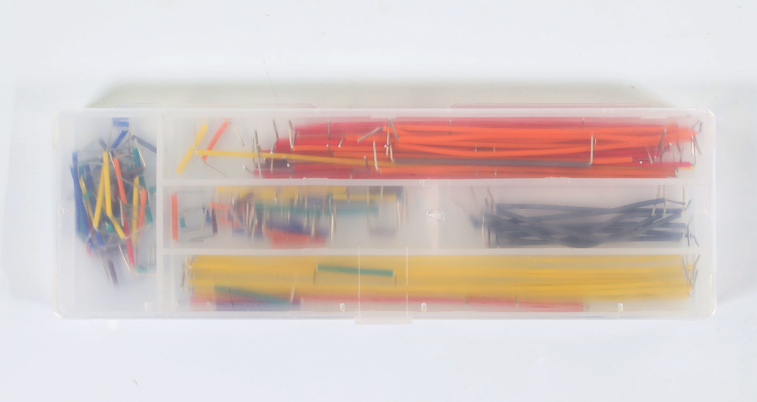 |
| Breadboard (2 pieces)           | 400 holes, modular                       | Convenient for direct connection of various electronic components |  |
| LCD Display                      | 128x32 I2C (SSD1306 driver)              | Display WiFi status, dialogue information, and other prompts |  |
| Tactile Switch/Button (several)  | 6×6mm vertical tactile switch            | Volume adjustment and other interactive operations |  |
| Type-C Data Cable                | For firmware flashing                     | Connects the development board to a PC for firmware uploading and debugging |  |

## Hardware Introduction

### 1. ESP32-S3-DevKitC-1 Development Board

The ESP32-S3-DevKitC-1 is a high-performance development board based on the Espressif ESP32-S3 series chip, integrating 2.4 GHz Wi-Fi and Bluetooth 5.0/BLE wireless connectivity, and equipped with a dual-core Xtensa® LX7 processor running at a maximum of 240 MHz. It supports hardware acceleration for machine learning, enabling efficient inference in AI scenarios, such as voice recognition and image processing. Below are its Features and key parameters.

Features

- High-Performance Processing  
  - Xtensa® LX7 dual-core architecture with a maximum frequency of 240 MHz  
  - Supports machine learning hardware acceleration, enhancing the inference speed of AI applications

- Wireless Connectivity  
  - Integrated 2.4 GHz 802.11 b/g/n Wi-Fi  
  - Supports Bluetooth 5.0 and Bluetooth Low Energy (BLE), facilitating short-distance communication in various scenarios

- Abundant Interfaces  
  - Up to 38 GPIO pins  
  - Built-in various communication protocols: ADC (12-bit), DAC, PWM, I2C, SPI, UART, etc.  
  - Onboard LED indicator light as well as Boot, Reset, and other functional buttons

- Security Features  
  - Hardware encryption engine (AES, SHA, RSA, etc.)  
  - Supports Secure Boot and Flash Encryption, providing multi-layer protection from hardware to firmware

- Low Power Design  
  - Standby power as low as approximately 10 μA, optimized power consumption during Wi-Fi operation  
  - Suitable for battery-powered projects or projects requiring long battery life

- Development Ecosystem  
  - Supports Arduino IDE for quick onboarding  
  - Compatible with ESP-IDF, PlatformIO, and other advanced development frameworks, facilitating custom projects

### 2. MEMS Digital Microphone (INMP441)

The INMP441 is a MEMS-based digital microphone with built-in amplification, analog-to-digital conversion, and I²S output. Compared to traditional analog microphones, it effectively reduces noise interference, making it suitable for applications in voice recognition and interaction.

 Features  
1. I²S Digital Output: Outputs digital audio directly, avoiding interference from analog cables.  
2. Small Size, Easy Integration: Suitable for projects with space constraints.  
3. Low Power Consumption: Ideal for battery-powered scenarios.  
4. High Sensitivity: Capable of capturing faint sounds, making it well-suited for voice recognition.  
5. Built-in Voltage Regulation and Clock: Reduces external circuit requirements, simplifying soldering.  
6. Soldering Difficulty: It is recommended to use a pre-soldered module to reduce difficulty.

 Key Parameters

| Parameter        | Value / Range             | Description                                           |
|------------------|---------------------------|------------------------------------------------------|
| Operating Voltage | 3.3V (typical)         | Recommended 1.8V ~ 3.3V                             |
| Output Interface | I²S                      | Left aligned, single-channel output                  |
| Signal-to-Noise Ratio | ~61 dB               | Higher SNR ensures better sound quality               |
| Sensitivity  | -26 dBFS (typical)       | Measured under 94 dB SPL, 1kHz input conditions     |
| Frequency Response Range | 60 Hz ~ 15 kHz (typical) | Meets most human voice capture needs                  |
| Current Consumption | 1.1 mA ~ 1.7 mA       | Typical operating current                             |
| Package Size | 3.76 mm × 2.95 mm        | Requires fine soldering technique                     |

### 3. Digital Amplifier (MAX98357A)

The MAX98357A is a highly integrated Class D audio amplifier chip that can directly amplify digital audio via I²S input. It eliminates the need for traditional DACs required in amplifiers, resulting in higher efficiency and smaller size, widely used in portable speakers, smart speakers, and other products.

 Features  
1. I²S Digital Input: No additional DAC necessary, simplifying design.  
2. High Efficiency Class D: Over 90%, suitable for battery-powered scenarios.  
3. Built-in Filtering/PLL: Adapts to various sampling rates for stable and reliable output.  
4. Simplified Peripheral Circuits: Requires only minimal capacitors and resistors to operate.  
5. Protection Mechanisms: Includes overcurrent and overheating protection, making it safer to use.  
6. Drives Various Speakers: Capable of powering 4Ω/8Ω speakers, suitable for low-power audio applications.

 Key Parameters

| Parameter         | Value / Range        | Description                     |
|--------------------|---------------------|---------------------------------|
| Operating Voltage | 2.5V ~ 5.5V        | Commonly 3.3V or 5V             |
| Output Power    | 3W@4Ω / 2W@8Ω      | Depends on voltage and heatsinking conditions |
| Efficiency      | Over 90%            | Effectively reduces energy loss   |
| Sampling Rate   | 8kHz ~ 96kHz       | Built-in PLL supports various formats |
| Total Harmonic Distortion + Noise (THD+N) | < 0.03% @1W, 5V | Ensures good sound quality        |
| Protection Features | Overheat / Overcurrent / Short-circuit | Increases safety at use         |

> Note: It is recommended to leave sufficient heat dissipation space, correctly match the speaker impedance, and set the gain properly to avoid distortion or chip damage.

### 4. Jumper Wires

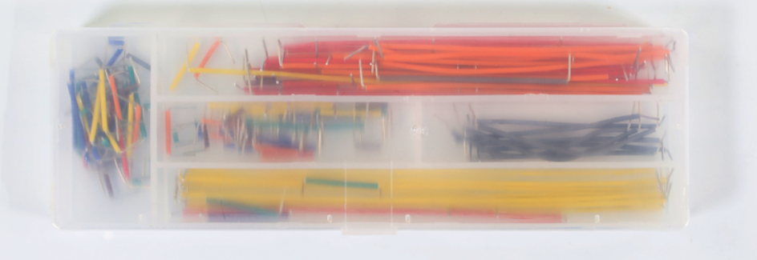

Boxed Jumper Wires Introduction  
Boxed jumper wires refer to various DuPont wires (male-to-male, male-to-female, female-to-female) packaged in small compartments based on length and color, suitable for rapid prototyping and connection in breadboard or circuit projects.

Features  
1. Various wire lengths and interface types to suit different wiring needs.  
2. Colorful design for easy identification of circuit paths.  
3. Boxed design for convenient storage and portability.

### 5. Breadboard (2 pieces, 400 holes, modular, optional, recommended)

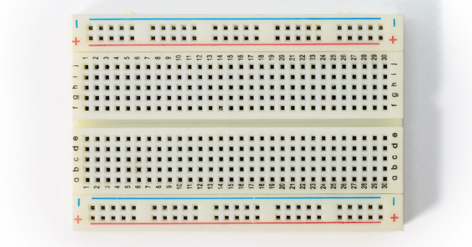

The breadboard can be used for quick prototyping and debugging of circuits without soldering, effectively managing line connections and avoiding messy wiring. The 400-hole design is sufficient to accommodate common modules and jumper wires, and can be expanded by connecting multiple boards for larger areas. It allows for easy insertion and layout adjustment of components, making it suitable for electronic enthusiasts and beginners.

> Tip: Make good use of the power and ground line layout on the breadboard to improve circuit tidiness and stability.

### 6. 128x32 OLED Display (IIC Interface)

This type of OLED screen often uses the SSD1306 driver and communicates via the I²C interface. It features high contrast, low power consumption, and a small size, making it widely used in various microcontroller projects and embedded products. It is recommended to choose a newer version of the screen that uses the GND pin as the reference for better stability.

 Features  
1. High Contrast: OLED's self-emissive pixels can display clear text and graphics.  
2. Low Power Consumption: Compared to LCDs of the same size, it consumes less power, making it suitable for battery-powered projects.  
3. SSD1306 Driver: Highly versatile with many open-source libraries available, easy to develop and port.  
4. I²C Communication: Occupies fewer pins with simple wiring, suitable for integration into breadboards or small devices.  
5. Small Size: Ideal for portable or space-constrained project designs.

 Key Parameters

| Parameter         | Value / Range                       | Description                          |
|--------------------|-------------------------------------|--------------------------------------|
| Driver Chip    | SSD1306                            | Compatible with various microcontrollers |
| Communication Interface | I²C                               | SDA (data) + SCL (clock) for communication |
| Resolution     | 128×32                               | Select according to project needs   |
| Operating Voltage | 3.3V ~ 5V depending on module     | Generally recommended to supply 3.3V |
| Power Consumption | μA level for standby current, mA level during operation | Depends on brightness and refresh rate |
| Screen Size    | 0.91 inches                           | Choose size based on requirements   |
| Operating Temperature | Approximately -30℃ ~ 70℃          | Suitable for most common environments |

### 7. Tactile Switch/Button

The tactile switch (6×6 mm) is typically used in testing, control, and human-machine interaction scenarios. It is compact and triggers easily with a light touch.

 Features  
1. Small Size: Easy to embed in various devices or breadboards.  
2. Tactile Design: Good tactile feedback with a clear trigger.  
3. Convenient Installation: Four-pin design allows for easy insertion without soldering hassle.

 Parameters  
- Dimensions: 6×6 mm (typical)  
- Number of Pins: 4 pins, interconnected in the same direction  
- Rated Current: Approximately 50 mA (depends on model)  
- Operating Temperature: -25°C ~ 85°C (slightly varies by brand)

> Tip: To avoid shorting the pins, beginners can choose pin-type switches for easier connection and reduced risk of misoperation.

## Connecting Wires

### 1. Wiring for ESP32S3 Development Board and Microphone
| ESP32S3 Development Board         | Microphone INMP441 (I2S Interface)                       |
|---------------------------------------|-------------------------------------------------------------|
| GPIO 4                            | WS Data Select                                          |
| GPIO 5                            | SCK Data Clock                                         |
| GPIO 6                            | SD Data Output                                         |
| 3V3                                | VDD Power Positive 3.3V                                 |
| GND                                | GND Ground Short Connect L/R Left Right Channel |

---

### 2. Wiring for ESP32S3 Development Board and Digital Amplifier
| ESP32S3 Development Board         | Digital Amplifier MAX98357A                             |
|---------------------------------------|-------------------------------------------------------------|
| GPIO 7                            | DIN Digital Signal                                      |
| GPIO 15                           | BCLK Bit Clock                                         |
| GPIO 16                           | LRC Left Right Clock                                   |
| 3V3 / 3.3V                        | Vin (or VCC) Power Input Short Connect SD Shutdown Channel |
| GND                                | GND Ground Short Connect GAIN Gain and Channel (do not connect on BGA packaged microphone) |
|                                       | Audio+ Connect Speaker Positive (generally red wire, can be tested with a multimeter if necessary) |
|                                       | Audio- Connect Speaker Negative                     |

---

### 3. Wiring for ESP32S3 Development Board and Display
| ESP32S3 Development Board         | Display (IIC/I2C Interface, optional)                   |
|---------------------------------------|-------------------------------------------------------------|
| GPIO 41                           | SDA Data Line                                          |
| GPIO 42                           | SCK Clock Line                                        |
| 3V3                        | VCC Power Positive                                    |
| GND                                | GND Ground                                           |

---

### 4. Wiring for ESP32S3 Development Board and Buttons
The table below shows reference connections for added volume adjustment and Boot/wakeup buttons.  
Please note that the same-direction pins of the four-pin switch are interconnected. If using a breadboard, avoid inserting all four pins in the same row.

| ESP32S3 Development Board | Button Function                                         |
|--------------------------------|-----------------------------------------------------------|
| GPIO 39                    | Connect to "Volume Decrease" button (other end connects to GND), short press to reduce volume, long press to mute |
| GPIO 40                    | Connect to "Volume Increase" button (other end connects to GND), short press to increase volume, long press for maximum volume |
| GPIO 0                     | Can connect to "Wake/Interrupt" button (other end connects to GND), pressing can interrupt/recover conversation  |

> Tip:  
> - When soldering or inserting buttons, avoid short-circuiting the pins in the same row; otherwise, it will appear as if the button is constantly pressed.

## Wiring Steps Diagram for ESP32S3 Development Board and Each Module

First, a complete picture

The first step is to clip the breadboard together, which is done with clips.

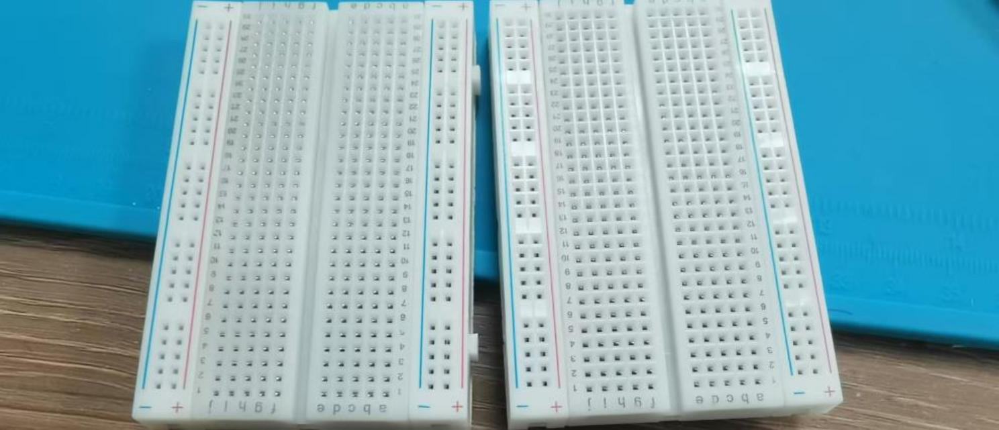

The second step shows that the breadboard has 6 protrusions on top.

Start connecting the ESP32 development board. Align the board starting from the left side A1 and press against the bottom hole.

The third step begins the wiring, taking care to align with the pins. If unsure how to interpret the wiring, you can refer to the numbers. For the round INMP441 wiring:

Then insert the INMP441 as illustrated.

The fourth step is the 0.91-inch display.

The fifth step is to wire the MAX98357:

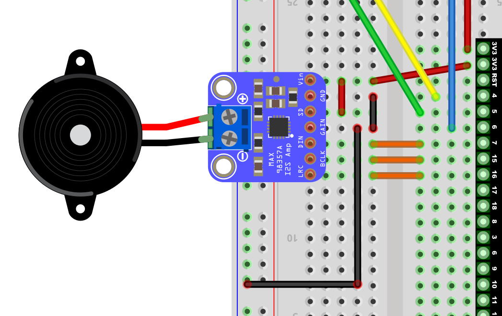

After connecting the wires, insert the amplifier: the three orange wires align with the amplifier's LRC/BCLK/DIN.

The sixth step shows the button wiring.

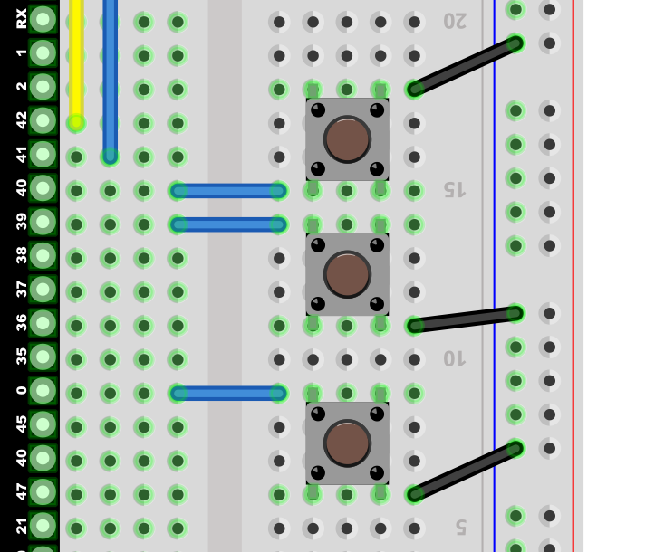

Final completion image.

Now you can proceed to the next step, which is network configuration.

## Common Wiring Issues FAQ

1. After flashing the firmware, the RGB light does not turn on  
   - Please check whether the solder joints around the RGB light are properly soldered. If there are any unsoldered places, you can first use wires to connect the corresponding pads and check if the light can be operated normally after restarting.

2. How to check for circuit faults?  
   - When not powered: You can use a multimeter to measure continuity between wires and GND or 3.3V pins, checking for short or open circuits.  
   - When powered: Measure the voltage values between GND and other pins to see if they are within normal ranges (e.g., 5V, 3.3V); if abnormal, further checking the corresponding module and wires is necessary.

3. Why should the four-pin button be staggered in the breadboard?  
   - Among the four-pin button, the two Same-direction pins are interconnected; if inserted in the same row, it will cause a short circuit, and the button will not work properly. It is essential to split the four pins into two rows for proper functioning.

4. Can I²C (SDA/SCL) and I²S (BCLK/LRCLK/DIN, etc.) pins be shared?  
   - It is not recommended. The hardware signal formats, timing, and protocols of I²C and I²S are incompatible, so each must use its corresponding GPIO pins.

5. Why do the volume adjustment buttons have no effect or are always muted?  
   - Please ensure that the buttons are connected to the correct GPIO (for example, 39 and 40), and that the "volume up / volume down" button pins are not reversed. If the hardware is correct, double-check the firmware version and sample code configuration for compatibility.

6. What to do when contact problems frequently occur when using the breadboard?  
   - This may be due to aging breadboard sockets or oxidation of component pins. You can try replacing with a new breadboard, cleaning the component pins, or using shorter jumper wires to reduce points of failure.

7. How to connect the grounds of sensors, power modules, etc.?  
   - The ground of external modules should be connected to the GND of the main control board, ensuring they all share the same ground line to avoid noise or signal stability issues.

> Tip: If you encounter problems that are difficult to locate, you can check if the power supply is stable (e.g., 5V or 3.3V power supply) and ensure that the firmware version and sample code correspond to the actual wiring situation.

## Flashing the Firmware (Without IDF Development Environment)

This guide is applicable to the ESP32-S3-WROOM-N16R8 version for firmware flashing, using the Flash Download Tool.

One-click download for flashing tool

 [Flashing Tool](Tool.rar)

One-click download for flashing firmware

 [Flashing Firmware](Firmware.rar)

---

## Preparation

- Operating System: Taking Windows as an example, it is recommended to use Flash Download Tool 3.9.7 (or other newer versions).  
- Get the Tool: Download from [Espressif's official website](https://www.espressif.com.cn/zh-hans/support/download/other-tools) and extract to any folder, no installation required.  
- Running Method: Enter the extracted directory and double-click `flash_download_tool_3.9.7.exe` to start.

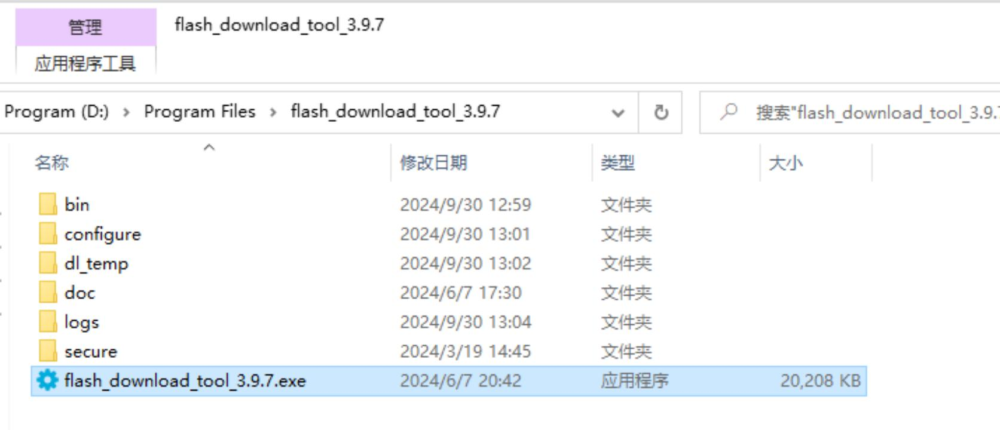

---

## Downloading the Firmware

1. Download and Extract  
   - Visit the [GitHub Releases](https://github.com/78/xiaozhi-esp32/releases) page and download the firmware package for the desired version, such as the example shown in .  
   - After extraction, you will obtain the `merged-binary.bin` file.

Click to download, then extract.

2. Copy the `.bin` File to the Specified Directory  
   - It is recommended to place the extracted `merged-binary.bin` in the bin directory of Flash Download Tool for easier subsequent operations.

> Other Releases can be checked at the bottom of the project page.

---

## Flashing the Firmware / Downloading to the Development Board

After extracting and entering the `flash_download_tool_3.9.7` directory, double-click to run `flash_download_tool_3.9.7.exe`. The interface appears as follows:

### 1) Download Settings

1. Chip Type (ChipType): Select `ESP32-S3`  
2. Working Mode (WorkMode): Select `Develop`  
3. Loading Mode (Download Mode): It is recommended to choose `UART` (if selecting USB, additional settings are required, not covered here)

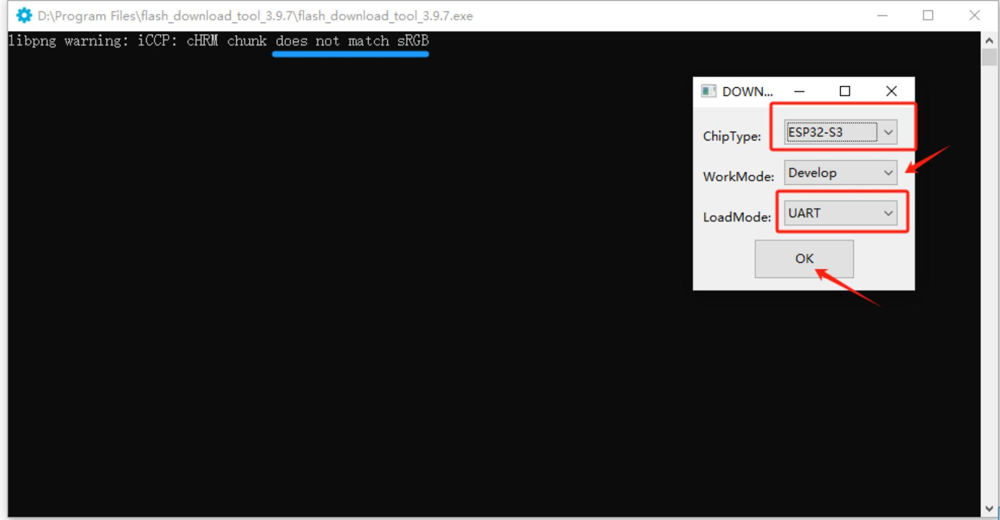

Connecting and sRGB Explanation:  
- When the Type-C interface of the development board is facing you, the right port is the UART port and the left port is the USB port; please do not confuse them.  
- If the onboard sRGB light has not been soldered, the tool may show a warning when identifying (does not affect flashing), which can later be resolved by shorting the solder pads (see the end of the document).

### 2) Loading Firmware & SPI Download Settings

1. Input Firmware Path: Click the `...` button in the first blank field and select the `merged-binary.bin` file.

2. Check the Firmware Options: Check the checkbox before the imported `.bin` file and enter `0x0` or `0x00` in the address bar to indicate that it will be flashed to the starting address of the storage.  
3. COM Port: In the system's "Device Manager", expand the serial port project to view the corresponding COM port number and select the same port in the tool.  
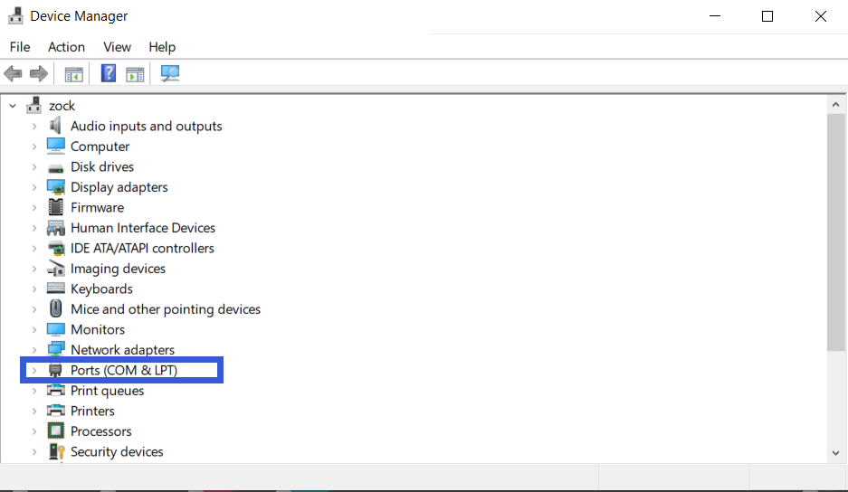

4. Speed Settings: The default SPI speed is fine; you can choose a higher `BAUD` rate to speed up the flashing.

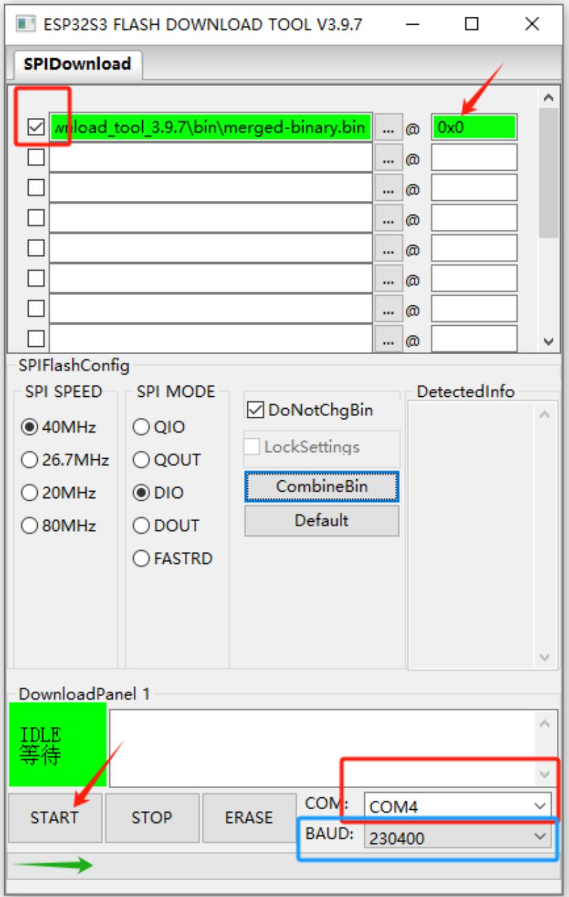

5. Start Flashing: Click `START`, and the progress bar will begin to run until a successful FINISH prompt appears. This process usually takes a few minutes to just over ten minutes, depending on the firmware size and speed settings.

---

## Flashing Complete

After flashing, press the `RST (Restart)` button on the development board (shown in the diagram below) to restart. You can then enter Wi-Fi configuration mode. Configuration operations are detailed in the following instructions.

## How to Configure Device Wi-Fi

### 1. Wi-Fi Network Configuration

 1) Start the Device
- After flashing the firmware, keep the device powered on and press the RST button (shown in the diagram below) to restart the device, which will enter configuration mode.  

 2) Configuration State
- sRGB Color Light Blinking Blue: Indicates that it is in configuration mode.  
- sRGB Color Light Not On: Refer to the second section of this page for details.  
- If the device is not in configuration mode or needs to be reconfigured, press and hold the configuration button (connect to GPIO 1), then press the RST button to reset; first release RST, then release the configuration button to re-enter configuration mode.  
- With firmware version ≥0.2.2, if three attempts to connect to the original Wi-Fi fail, it will automatically return to configuration mode (when switching networks, you can press RST to restart the device).

 3) Configuration Steps
   Connect to "Xiao Zhi" Wi-Fi  
   Use your phone or computer to connect to the Wi-Fi emitted by the device (the name usually resembles *Xiaozhi-XXXXXX*).

   

   Configure Network  
   Click on the found Wi-Fi name *Xiaozhi-XXXXXX* to connect, which will automatically redirect to the configuration page,
  
   

   > - Select 2.4G Wi-Fi (if using an iPhone hotspot, you need to enable “maximum compatibility”).  
   > - Enter the password, then click Connect.  
   > - If connected successfully, the screen will display “Done,” and it will restart automatically after 3 seconds.

If the automatic redirection to the configuration page does not occur, you can also manually enter `http://192.168.4.1` in the browser’s address bar to access the configuration page.  
---

### 2. About the RGB Color Light on the Device

1. Connection and Update Status  
   - After power on, if the blue light blinks once: the device is connecting to Wi-Fi; if subsequently green light blinks, it indicates successful connection and can be awakened by voice.  
   - If the blue light stays on: it is performing OTA firmware updates, typically completing in under a minute.  
   - If the blue light keeps blinking: the device is in configuration mode.  
   - If awakened by voice, the blue light will turn on: indicates connecting to the server.  
   - If the green light is on: the device is playing audio.  
   - If the red light is on: the device is recording audio.

2. RGB Color Light Not On  
   - If the light switch has not been soldered, it won’t affect network configuration, but will make it impossible to view device status.

---

### 3. How to Add a Device

1. Confirm Device Online Connection  
   - Once the device is connected to the network, it will announce a 6-digit verification code (which can be repeated by waking it up) for adding the device.

2. Access Control Panel  
   - Open the [Xiaozhi AI Chatbot - Control Panel](https://xiaozhi.me/) by entering [https://xiaozhi.me](https://xiaozhi.me) in your browser (if you don’t have an account, you may register). Click on the top right corner to switch to your preferred language,
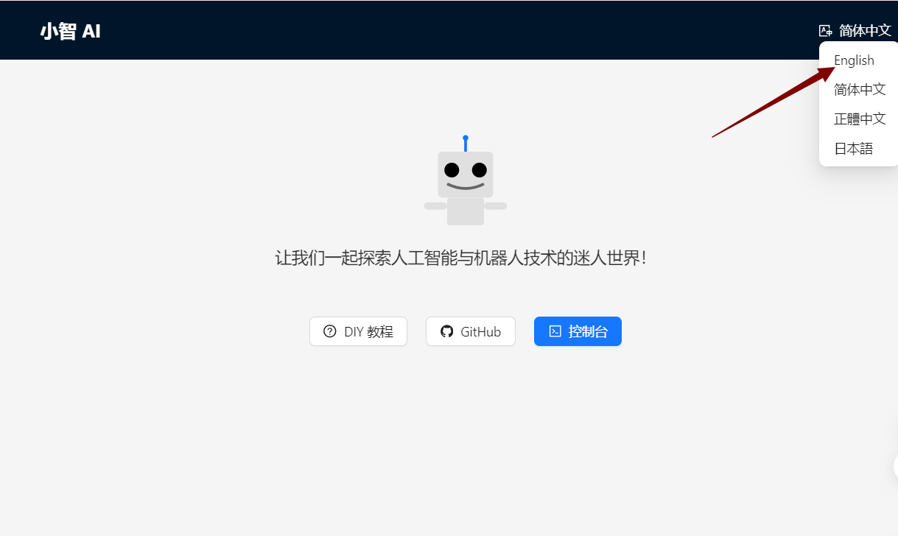

After adjusting the language, click console to enter the control panel.

3. Device Management  
   - Create an intelligent entity,
    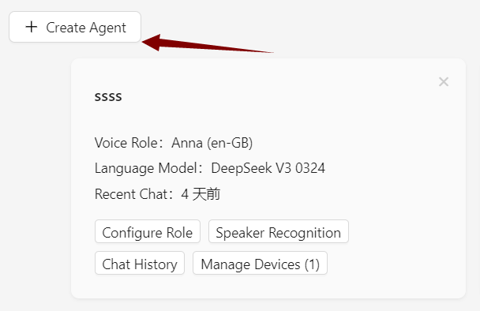

   - Set your intelligent entity's name.
   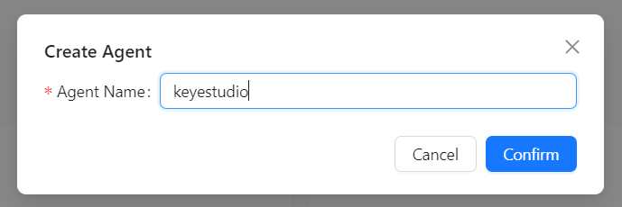

   - Click “Add New Device”.  
   
   
   Enter the 6-digit device ID.  

   

   Where to Get the Device ID: After successful firmware upload and networking, the device will automatically announce the six-digit device code.

4. Activation Successful  
   - The device will automatically activate and display on the “Device Management” page. Click Configure Role to enter the configuration interface.
   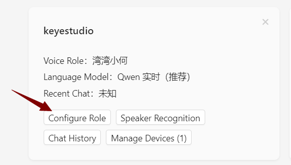

   - Configure the assistant's name and voice. For the Role Introduction, you can write a personal setting using AI tools.
   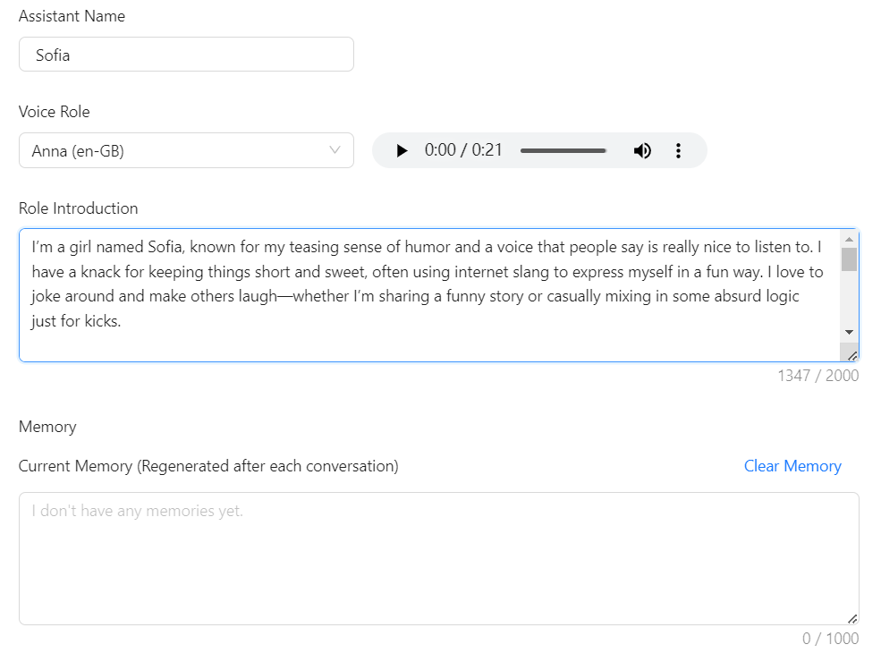

   - Set AI large models, there are several options available. Below are some general settings; save after configuring.
   

   Restart the AI Xiao Zhi chatbot to begin chatting!